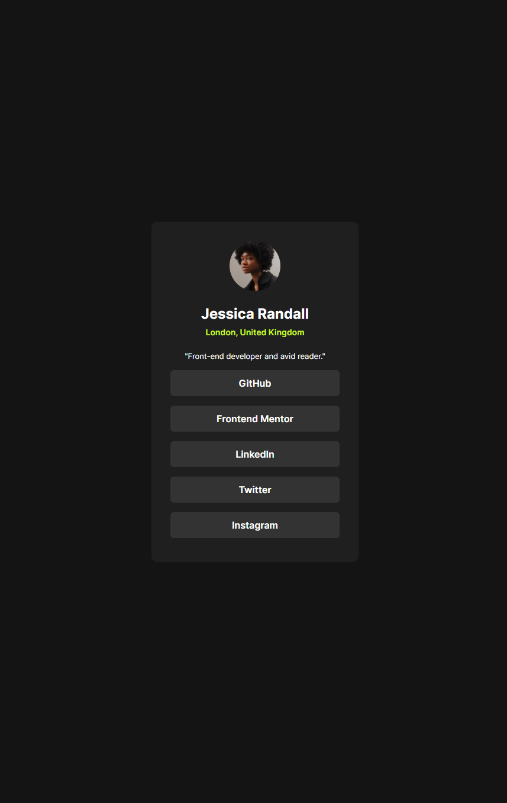

# Frontend Mentor - Social links profile solution

This is a solution to the [Social links profile challenge on Frontend Mentor](https://www.frontendmentor.io/challenges/social-links-profile-UG32l9m6dQ). Frontend Mentor challenges help you improve your coding skills by building realistic projects. 

## Table of contents

- [Overview](#overview)
  - [The challenge](#the-challenge)
  - [Screenshot](#screenshot)
  - [Links](#links)
- [My process](#my-process)
  - [Built with](#built-with)
  - [What I learned](#what-i-learned)
  - [Continued development](#continued-development)
- [Author](#author)

## Overview

### The challenge

Users should be able to:

- See hover and focus states for all interactive elements on the page

### Screenshot

### Links

- Solution URL: [Source Code](https://github.com/axah37/frontend-mentor-social-links-profile)
- Live Site URL: [Live Site](hhttps://axah37.github.io/frontend-mentor-social-links-profile/)

## My process

### Built with

- Semantic HTML5 markup
- CSS custom properties

### What I learned

This project was very similar to the last challenge, blog post preview. I used the same techniques. While I didn't learn anything new, I did have a chance to practice those skills. 

### Continued development

In future projects, I want to continue improving my code organizations, and try to have a more modular layout from the start. I feel like I spent a lot of time fussing with the layout to align the text when I could have just wraped my content and handled alignment in one place. 

## Author

- Frontend Mentor - [@axah](https://www.frontendmentor.io/profile/axah37)
- Github - [@axah](https://www.github.com/axah37)